# 01 Exercise - CSS Grid

## Exercise Brief

Practice building grids by creating several elements of a web page, and then combine them together to create a complete page design. Use the mobile first philosophy by having your grids work inside media queries.

## Rationale

Being able to build different CSS layouts is an important skill as a Web Developer. By learning CSS Grid, you will be able to build complex, responsive layouts using only CSS.

---

## Getting Started

1. `clone` the exercise repository to your local computer using VS Code or the Terminal.
2. The code for this exercise should go into `/Submission/style.css`.

---

## Exercise Part A - Build an article component

Build an article component, where the final result looks like the following image

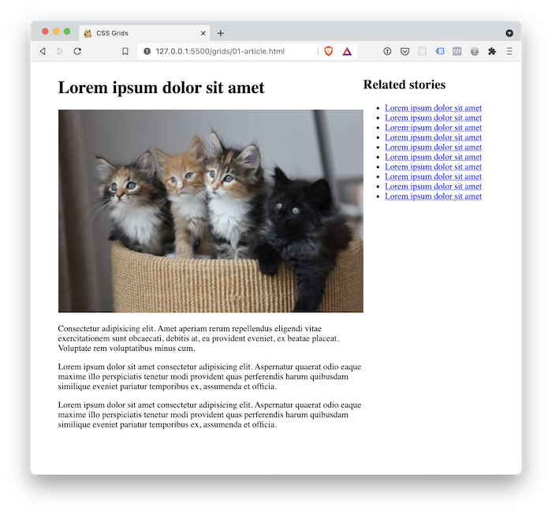

1. Open `/Submission/grids/01-article.html` using Live Server. Your page should look like this:
    
    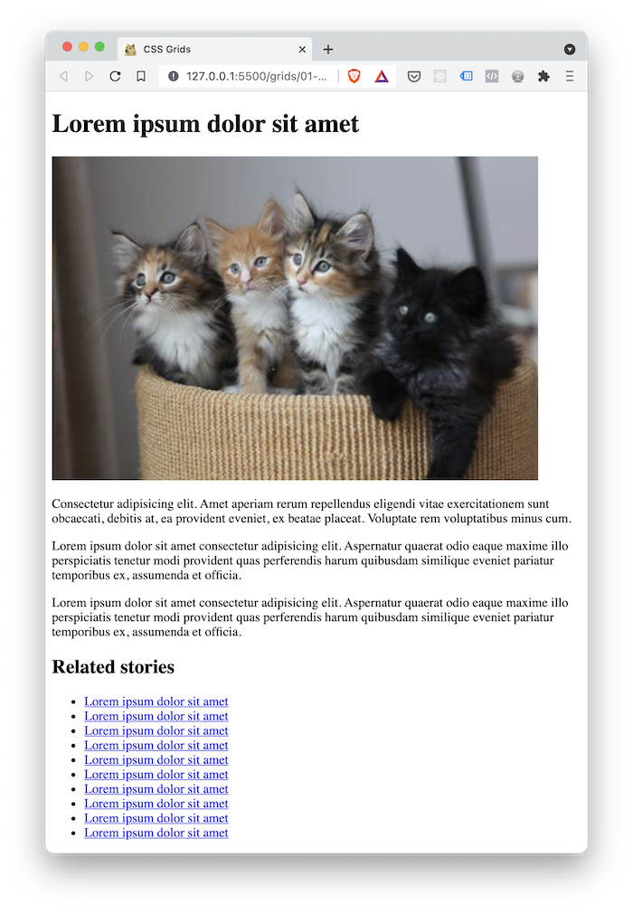

2. Open `Submission/style.css`. You will notice a media query has been written, but it is empty. Inside this media query, add a CSS selector for the article element:

    ```css
    @media (min-width: 31.25rem) {
      .article {

      }
    }
    ```

3. Make it display grid, assign `grid-template-column`'s, and give it a grid gap

    ```css
    .article {
      display: grid;
      grid-template-columns: 70% 30%;
      grid-gap: 2rem;
    }
    ```

## Exercise Part B - Build a footer

Build a footer component, where the final result looks like the following image

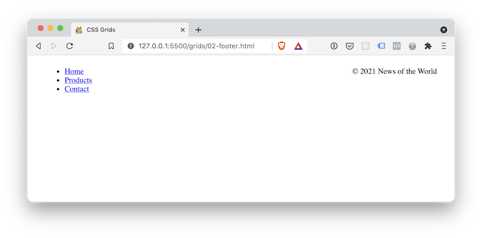

1. Open `Submission/grids/02-footer.html` using Live Server. Your page should look like this:
  
    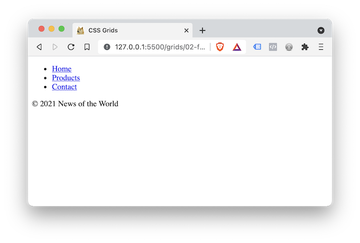  

2. Follow the same process as the article to create a grid for the `.footer` element. Make sure your styles are inside the media query.
3. Make the grid columns equal width: `1fr 1fr`
4. Make the copyright paragraph `text-align: right`. This will make the text sit on the right edge of the page. 

    ```css
    .copyright {
      text-align: right;
    }
    ```

## Exercise Part C - Build an article listing

Build an article listing component, where the final result looks like the following image

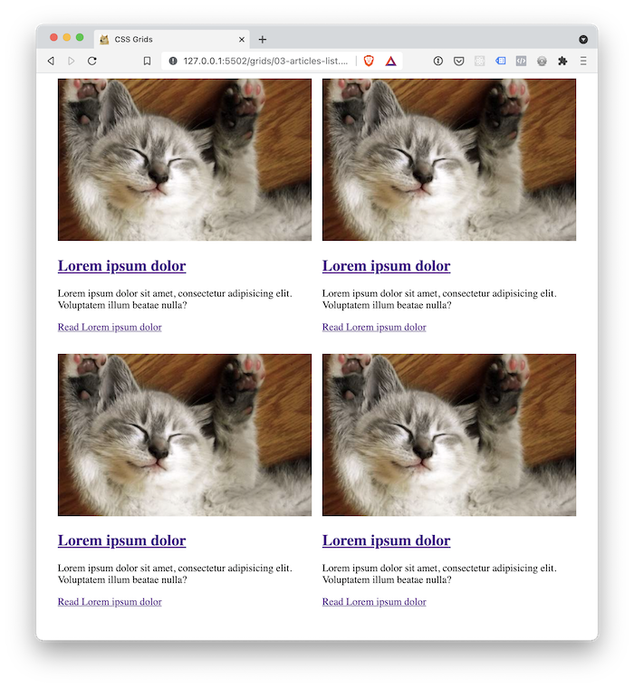

1. Open `Submission/grids/03-articles-list.html` using Live Server. Your page should look like this:
  
    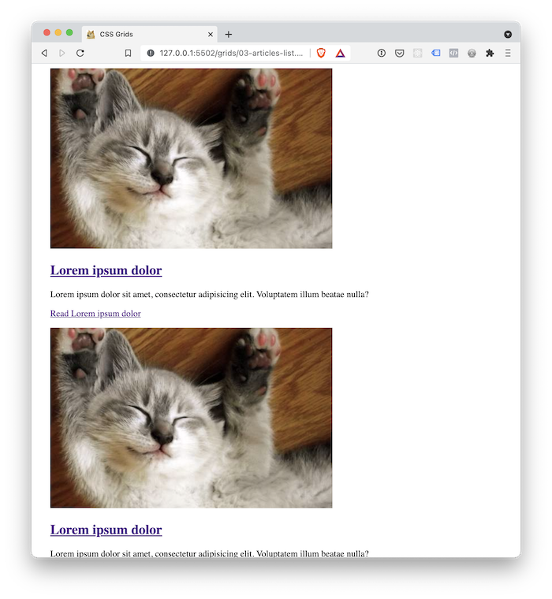

2. Create a grid for `.articles-list` that has two columns
3. Make the grid columns equal width: `1fr 1fr`
4. Set the `grid-gap` to be `1rem`

## Exercise Part D - Build a navigation menu

Build a navigation menu component, where the final result looks like the following image

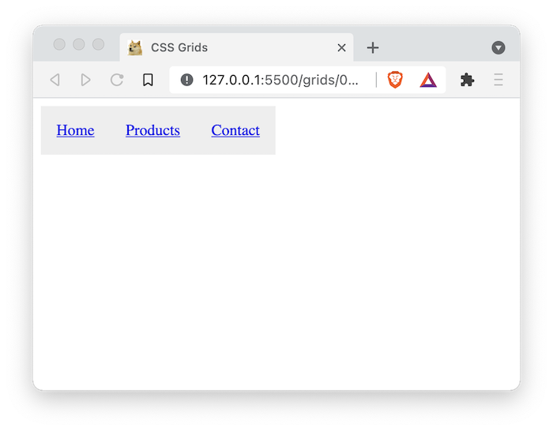

1. Open `Submission/grids/04-navigation.html` using Live Server. Your page should look like this:
  
    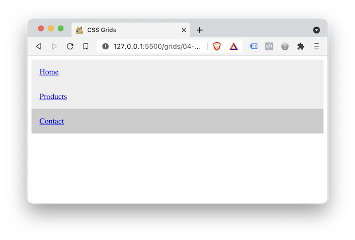

2. Create a grid for                                                                                             `.primary-nav-list` that has three columns, all set to `min-content`. This will mean the grid items take up as much space as the text in the navigation menu.

## Exercise Part E - Create a header

Build a header component, where the final result looks like the following image

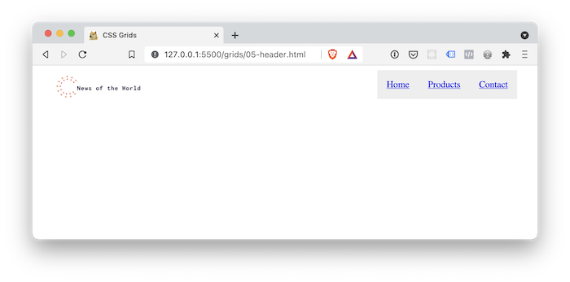

1. Open `Submission/grids/05-header.html` using Live Server. Your page should look like this:
  
    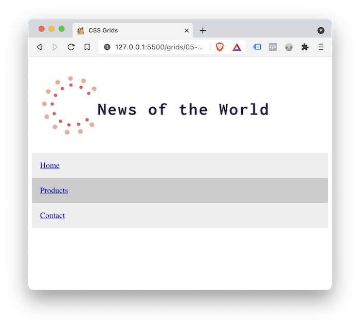

2. Create a grid for `.header` that has two columns, where the first column is `10rem` and the second column is `auto`
3. You want the logo to be centered. You can use CSS Grid properties to do this. Add the following rule to your CSS file:

    ```css
    .logo {
      justify-self: center;
      align-self: center;
    }
    ```

4. You also want the navigation to be right aligned on the screen. Using the `justify-self` property enables you to align elements in the grid. Add the following rule to your CSS file:

    ```css
    .primary-nav {
      justify-self: end;
    }
    ```

## Exercise Part F - Put the pieces together

Open `Submission/home.html` in Live Server. This is a combination of all the components you applied grid to that make up an entire web page. It uses the articles list as the main content in the page.

Create a new file in in the `Submission` folder named `article.html`. 

Use `home.html` and the existing components in the `grids` folder as references, and make a new page that displays a single article. Instead of displaying the article list, it should display the article page.

Your page should end up looking like the following screenshot

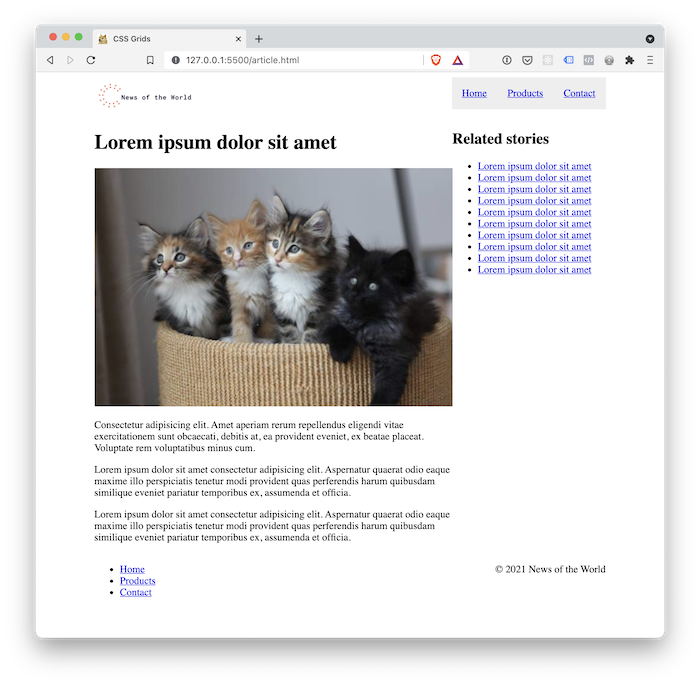


---

# Submit your Exercise

- [ ] Push your code to GitHub by typing `git push`
- [ ] "Mark as done" in Google Classroom

# Walkthrough Solution Video

- Please attempt the exercise first prior to watching the following solution video
- [Loom](https://www.loom.com/share/6a79819010de40fa9dfe644c55899cdf)
